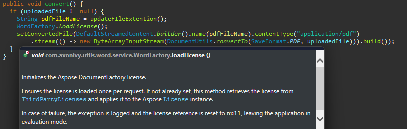

# Axon Ivy Words
*(formerly Docfactory Doc)*

**Axon Ivy Words** is a lightweight utility that simplifies document processing tasks inside the Axon Ivy Platform. It builds on the embedded Aspose.Words Java library and provides ready-to-use building blocks for common document operations.

### Key Features
- **Effortless license setup** – Load and configure the Aspose license via the `WordFactory` with minimal overhead.
- **Reusable components** – Predefined runnable and consumable methods accelerate development and ensure consistency.
- **Lightweight and extendable** – Small footprint, easy to install, integrate, and adapt to your project’s needs.

## Setup
Make sure the Aspose license is loaded through the `WordFactory` class before processing any document.

## Best Practice: Mail Merge with Images

For inserting images into mail merge templates, we recommend using the [Aspose DocumentBuilder](https://docs.aspose.com/words/java/insert-picture-in-document/),
This approach programmatically retrieves and embeds images, offering a more stable and maintainable solution than relying on the `INCLUDEPICTURE` field.
