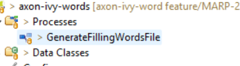

# Axon Ivy Words
*(formerly Docfactory Doc)*

**Axon Ivy Words** is a lightweight utility that simplifies document processing tasks inside the Axon Ivy Platform. It builds on the embedded Aspose.Words Java library and provides ready-to-use building blocks for common document operations.

### Key Features
- **Effortless license setup** – Load and configure the Aspose license via the `WordFactory` with minimal overhead.
- **Reusable components** – Predefined runnable and consumable methods accelerate development and ensure consistency.
- **Lightweight and extendable** – Small footprint, easy to install, integrate, and adapt to your project’s needs.

## Setup
Make sure the Aspose license is loaded through the `WordFactory` class before processing any document.

## For User

### Java Classes

Callable Process is available from the Axon Ivy Words project to cover a maximum of your needs in document production. They use three kinds of Java Objects to perform their task.

#### TemplateMergeField

The TemplateMergeField class represents a merge field in a template with two String attributes: name and value.

**Attributes:**

| Field | Type | Description |
|-------|------|-------------|
| `mergeFieldName` | String | Name of the merge field. If the name is in the form "Image:ImageName" or "Image_ImageName", it indicates that an image will be placed into the respective merge field |
| `mergeFieldValue` | String | The value of the merge field. For image merge fields, this indicates the path to the image (e.g., `file:///Icons/warning48.png` or `C:/Icons/warning48.png`) |

#### DocumentTemplate

The DocumentTemplate class represents a complete document to be generated and contains all necessary information for the mail merge engine.

**Attributes:**

| Field | Type | Description |
|-------|------|-------------|
| `templatePath` | String | File path of the template to use for mail merging (on the Engine) |
| `outputPath` | String | Path of the folder where to store the produced document |
| `outputName` | String | Name of the output file or document |
| `outputFormat` | String | Desired format of the output document (doc, docx, etc.) |
| `mergeFields` | List\<TemplateMergeField\> | List of merge fields that should be present in the template |
| `data` | CompositeObject (DataClass) | Alternative to List of TemplateMergeFields - each attribute links to a template merge field with the same name |
| `documentFactory` | BaseDocument | The engine responsible for mail merge |
| `tablesNamesAndFieldsHashtable`* | Hashtable\<String, Recordset\> | For mail merge with regions using Recordsets |

#### Files

All files produced during the mail merge operation, available for further actions like printing, editing, or downloading.

### Callable Process
A callable process is available to ease the use of the document. This is available to ease the use of the document factory, located in the Words Functional Process folder.

The Callable named generateFillingWordsFiles contains callable createDocFromTemplate subprocess starts. Which is responsible for the document generation. It uses the DocumentTemplate and TemplateMergeField classes to perform a mail merge operation.

## Best Practices: Mail Merge with Images

For inserting images into mail merge templates, we recommend using the [Aspose DocumentBuilder](https://docs.aspose.com/words/java/insert-picture-in-document/). This approach programmatically retrieves and embeds images, offering a more stable and maintainable solution than relying on the INCLUDEPICTURE field.

## API Reference

Multiple constructors are available for the DocumentTemplate class. Refer to the JavaDoc documentation for detailed information about all available constructors and methods.

## License

This project uses the Aspose.Words Java library. Ensure you have a valid Aspose license configured before using this utility.
