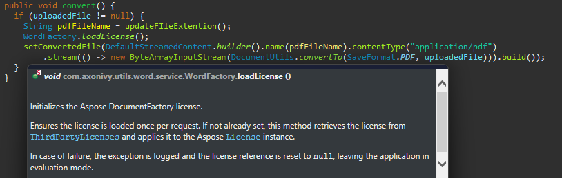

# Axon Ivy Words
*(ehemals Docfactory Doc)*

**Axon Ivy Words** ist ein leichtgewichtiges Dienstprogramm, das
Dokumentverarbeitungsaufgaben innerhalb der Axon Ivy-Plattform vereinfacht. Es
baut auf der eingebetteten Aspose.Words Java-Bibliothek auf und bietet
gebrauchsfertige Bausteine für gängige Dokumentoperationen.

### Wichtigste Funktionen
- **Mühelose Lizenzkonfiguration** – Laden und konfigurieren Sie die
  Aspose-Lizenz über `WordFactory` mit minimalem Aufwand.
- **Wiederverwendbare Komponenten** – Vordefinierte ausführbare und nutzbare
  Methoden beschleunigen die Entwicklung und gewährleisten Konsistenz.
- **Leichtgewichtig und erweiterbar** – Geringer Speicherbedarf, einfach zu
  installieren, zu integrieren und an die Anforderungen Ihres Projekts
  anzupassen.

## Einrichtung
Stellen Sie sicher, dass die Aspose-Lizenz über die Klasse „ `WordFactory` ”
geladen ist, bevor Sie ein Dokument verarbeiten.

## Bewährte Vorgehensweise: Seriendruck mit Bildern

Zum Einfügen von Bildern in Seriendruckvorlagen empfehlen wir die Verwendung von
[Aspose
DocumentBuilder](https://docs.aspose.com/words/java/insert-picture-in-document/).
Dieser Ansatz ruft Bilder programmgesteuert ab und bettet sie ein. Er bietet
eine stabilere und wartungsfreundlichere Lösung als die Verwendung des Feldes „
`INCLUDEPICTURE` ”.
